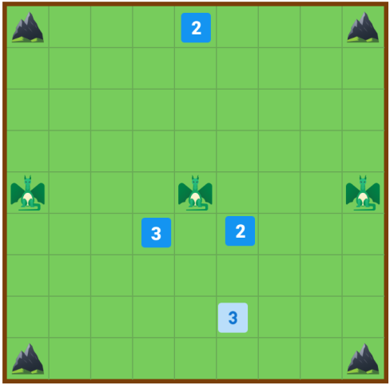

# feup-plog-proj1

## Class 2 T2_Three_Dragons_5

- Fábio Moreira ([up201806296](mailto:up201806296@fe.up.pt))
- Luís Tavares ([up201809679](mailto:up201809679@fe.up.pt))  

## The game: _Three Dragons_

[_Three Dragons_](https://boardgamegeek.com/boardgame/306972/three-dragons) is a 2-player board game, created by [Scott Allen Czysz](https://drive.google.com/drive/folders/1xNoHSM08SChVW2TWtzU8Qje6m7hxrEYh), a board game designer. The game is inspired by ancient custodial capture board games, such as Tablut, with some differences:

1. The pieces have a related strength value. Only a stronger piece can capture a weaker piece;
2. There are three dragon caves in the board which allow players to get stronger pieces.

The latest version of the game is v0.40 released in 19th February 2020. The official Google Drive folder of the creator can be [accessed here](https://drive.google.com/drive/folders/1xNoHSM08SChVW2TWtzU8Qje6m7hxrEYh).

### The board

The board consists a 9x9 square board with a mountain at each corner, three dragon caves in the middle row spaced with three squares, 8 white dices and 8 black dices (or any arbitrary color).

### Gameplay

#### Gameflow

1. White move first.
2. At each turn the player must move on piece orthogonally any number of squares. Pieces may not overlap any mountain, dragon cave or game pieces.
3. A capture occurs when a player surrounds an opponent's piece on two opposite sides, or one player piece and a mountain or dragon cave. The enemy piece is removed.
4. The winner is declared when the opponent is reduced to only one piece.

#### Variants

1. Capture by strength: occurs when the player move their piece to the side of a opponent's weaker piece. The opponent's piece is removed and the player's piece is weakened by 1 level.
2. Surrounding a dragon cave results in obtaining an extra playing piece (**summoning a dragon**). The side caves adds an extra 3 level piece to the player and the center cave an extra 5 level piece. 

#### Gameplay notes

1. If a player moves their piece between two opponent pieces the piece **is not captured**.
2. It is only possible to obtain 3 dragons (1 for each cave).
3. The player can decide by a 'normal capture' or 'level capture'.
4. A player can capture multiple pieces with 'normal capture' but only one with 'level capture'.

## Game representation

#### Initial State

 &nbsp; &nbsp; &nbsp;   
  
#### Middle State
 &nbsp; &nbsp; &nbsp;   
  
#### Final State
 &nbsp; &nbsp; &nbsp; 

## Board visualization

Since our board is represented as a list of lists of atoms, we use the predicate _translate_ to print out the various elements (few examples provided below):  

&nbsp;&nbsp;&nbsp;&nbsp;:- translate(+Atom, -Translated).  
&nbsp;&nbsp;&nbsp;&nbsp;translate(empty, S) :- S='    '.  
&nbsp;&nbsp;&nbsp;&nbsp;translate(black2,S) :- S=' B2 '.  
&nbsp;&nbsp;&nbsp;&nbsp;translate(white3, S)       :- S=' W3 '.  
&nbsp;&nbsp;&nbsp;&nbsp;translate(mountain, S)     :- S=' M  '.  
&nbsp;&nbsp;&nbsp;&nbsp;translate(cave, S)         :- S=' C  '.  
  

In order to display the board, we use the predicate _displayBoard_, which will in turn, make calls to the predicates _printMatrix_ and _printList._

&nbsp;&nbsp;&nbsp;&nbsp;:- displayBoard(+Board).  
&nbsp;&nbsp;&nbsp;&nbsp;displayBoard(X) :-
&nbsp;&nbsp;&nbsp;&nbsp;&nbsp;&nbsp;&nbsp;&nbsp;printColumnsRow,
&nbsp;&nbsp;&nbsp;&nbsp;&nbsp;&nbsp;&nbsp;&nbsp;printSeparator,
&nbsp;&nbsp;&nbsp;&nbsp;&nbsp;&nbsp;&nbsp;&nbsp;printMatrix(X,1).

&nbsp;&nbsp;&nbsp;&nbsp;:- printMatrix(+Matrix, +N)
&nbsp;&nbsp;&nbsp;&nbsp;printMatrix([], _N).
&nbsp;&nbsp;&nbsp;&nbsp;printMatrix([Head | Tail], N) :-
&nbsp;&nbsp;&nbsp;&nbsp;&nbsp;&nbsp;&nbsp;&nbsp;write(N),
&nbsp;&nbsp;&nbsp;&nbsp;&nbsp;&nbsp;&nbsp;&nbsp;write('|'),
&nbsp;&nbsp;&nbsp;&nbsp;&nbsp;&nbsp;&nbsp;&nbsp;printList(Head),
&nbsp;&nbsp;&nbsp;&nbsp;&nbsp;&nbsp;&nbsp;&nbsp;printSeparator,
&nbsp;&nbsp;&nbsp;&nbsp;&nbsp;&nbsp;&nbsp;&nbsp;N1 is N+1,
&nbsp;&nbsp;&nbsp;&nbsp;&nbsp;&nbsp;&nbsp;&nbsp;printMatrix(Tail, N1).

&nbsp;&nbsp;&nbsp;&nbsp;:- printList(+List).
&nbsp;&nbsp;&nbsp;&nbsp;printList([]) :- nl.
&nbsp;&nbsp;&nbsp;&nbsp;printList([Head|Tail]) :-
&nbsp;&nbsp;&nbsp;&nbsp;&nbsp;&nbsp;&nbsp;&nbsp;translate(Head, X),
&nbsp;&nbsp;&nbsp;&nbsp;&nbsp;&nbsp;&nbsp;&nbsp;write(X),
&nbsp;&nbsp;&nbsp;&nbsp;&nbsp;&nbsp;&nbsp;&nbsp;write('|'),
&nbsp;&nbsp;&nbsp;&nbsp;&nbsp;&nbsp;&nbsp;&nbsp;printList(Tail).

